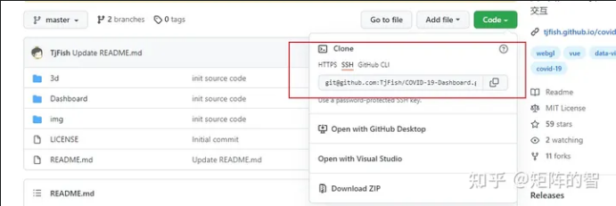

<p align='center'> </img></p>

<p align="center">
	<a href="#01VSCode连接Github"> 01VSCode连接Github </a> | 
	<a href="#02标题2"> 02标题2 </a> | 
	<a href="https://github.com/pluja/awesome-privacy/blob/main/misc/QUOTES.md"> 03 ??? </a> | 
	<a href="https://github.com/pluja/awesome-privacy/discussions"> 04 ??? </a>
</p>

## 01VSCode连接Github

**参考知乎的文章**, [*设置代理解决github被墙*](https://zhuanlan.zhihu.com/p/481574024)

1. 生成密钥对, 参考B站[教程](https://www.bilibili.com/video/BV1dV411G77N/?vd_source=fc841ae46284f484686eebead19c077f)
   * 首先安装Git, 设置用户名和邮箱, 安装完成后桌面右击选择Git bash, 输入命令: ssh-keygen, 后面都是回车
   * 密钥在: /C:/user/alanx/.ssh文件夹下
   * 配置公钥: 打开Github的Settings->SSH and GPG keys->New SSH Key, 将本地电脑C盘内/user/alanx/.ssh文件夹下的.pub内所有内容复制到Github的key中
   * 测试: Git bash中输入: ssh -T git@github.com, 此时电脑代理设置全局+系统代理, VSCode和Github能进行同步
2. 配置VSCode和Github的专用SSH代理, 参考知乎[教程](https://zhuanlan.zhihu.com/p/481574024)
   * 设置Https代理
     ```
     #使用socks5代理（推荐）
     git config --global http.https://github.com.proxy socks5://127.0.0.1:10808
     #使用http代理（不推荐）
     git config --global http.https://github.com.proxy http://127.0.0.1:10808
     #不需要代理时取消代理
     git config --global --unset http.proxy git config --global --unset https.proxy
     ```
   * 设置SSH代理(终极解决方案)
     **Https代理存在局限, 没法身份验证, 拉取私库或推送代码时, 需要输入Github的账户密码, 设置SSH代理前, 请确保已经设置了SSH Key. 只需要添加一个config文件即可
     ```
     # Linux、MacOS
     vi ~/.ssh/config
     # Windows 
     到C:\Users\your_user_name\.ssh目录下，新建一个config文件（无后缀名）
     #对于Win, 代理会用到Git中的connect.exe, 这个程序在Git的安装目录下, Git安装目录\Git\mingw64\bin\connect.exe
     #将下面的内容复制到config文件中, 注意替换connect.exe的路径和代理的端口号
     ProxyCommand "C:\APP\Git\mingw64\bin\connect.exe" -S 127.0.0.1:51837 -a none %h %p

     #MacOS用户用下方这条命令，注意替换你的端口号
     #ProxyCommand nc -v -x 127.0.0.1:51837 %h %p

     Host github.com
       User git
       Port 22
       Hostname github.com
       # 注意修改路径为你的路径, 密钥有3种注意替换成自己的, 比如我的是id_ed25519
       IdentityFile "C:\Users\Your_User_Name\.ssh\id_rsa"
       TCPKeepAlive yes

     Host ssh.github.com
       User git
       Port 443
       Hostname ssh.github.com
       # 注意修改路径为你的路径
       IdentityFile "C:\Users\Your_User_Name\.ssh\id_rsa"
       TCPKeepAlive yes

     ```

**最后测试是否成功**: `ssh -T git@github.com`, 推荐以后走SSH拉取, Github上Clone时选择SSH地址:



## 02标题2
